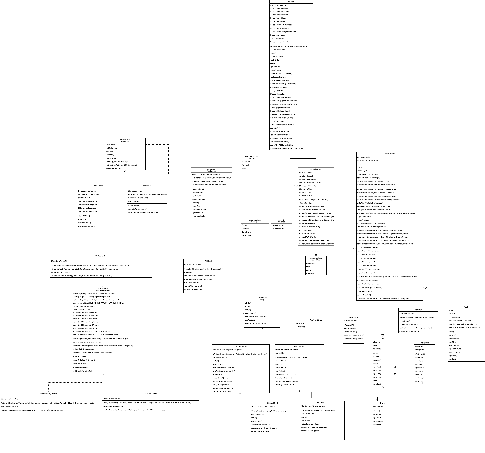

# Project Name 🚀

[](LICENSE.md)

## Table of Contents 📋
- [Project Description](#project-description)
- [Features](#features)
- [Prerequisites](#prerequisites)
- [Getting Started](#getting-started)
- [Usage](#usage)
- [Screenshots](#screenshots)
- [UML Diagram](#uml-diagram)
- [Naming Convention](#naming-convention)
- [Contributing](#contributing)
- [License](#license)
- [Acknowledgments](#acknowledgments)

## Project Description 📄

Welcome to [Project Name]! 🌟

[Project Name] is a [brief description of your project]. It aims to [describe the main purpose and goals of your project]. [Explain how it solves a problem or addresses a need]. The project offers a range of features to make [describe what the project does] easier and more efficient.

## Features 🌟

[Highlight the key features of your project in detail using emojis.]
- 🖼️ **Runtime View Switching**: Easily switch between 2D, overlay, and text-based views during program execution.
- 🕹️ **Interactive Protagonist**: Control the protagonist using arrow keys for smooth navigation.
- 🕹️ **Auto-Play Mode**: Activate auto-play mode where the protagonist takes charge automatically.
- 🦹 **XEnemy**: Encounter and deal with the mysterious XEnemy with unique behavior.
- 🌐 **Path Visualization**: Visualize the path followed by the protagonist during auto-play.
- 🏞️ **Overlay Maps**: Experience a rich world with overlay maps, allowing for different visual and data layers.
- 🌍 **Multilevel Gameplay**: Transition between maps using special Tiles (Door/Portal) for diverse gameplay experiences.

## Prerequisites 🛠️

[Specify any prerequisites or requirements for using your project. This can include software, libraries, or hardware that users need to have in place before they can get started with your project.]

## Getting Started 🚀

[Provide user-friendly instructions on how to get started with your project. Include installation or setup steps.]

1. Clone the repository.
   ```bash
   git clone https://gitlab.kuleuven.be/groep-t/courses/apt/2324/team-a4-fa.git

## Acknowledgements
* **Craftpix.net** <br> [](https://craftpix.net)

## UML
